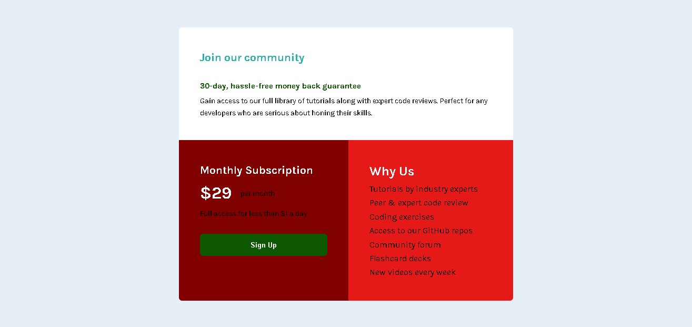

# Frontend Mentor - Single price grid component solution

This is a solution to the [Single price grid component challenge on Frontend Mentor](https://www.frontendmentor.io/challenges/single-price-grid-component-5ce41129d0ff452fec5abbbc). Frontend Mentor challenges help you improve your coding skills by building realistic projects. 

## Table of contents

- [Overview](#overview)
  - [The challenge](#the-challenge)
  - [Screenshot](#screenshot)
  - [Links](#links)
- [My process](#my-process)
  - [Built with](#built-with)
  - [What I learned](#what-i-learned)
  - [Continued development](#continued-development)
  - [Useful resources](#useful-resources)
- [Author](#author)
- [Acknowledgments](#acknowledgments)


## Overview

### The challenge

Users should be able to:

- View the optimal layout for the component depending on their device's screen size
- See a hover state on desktop for the Sign Up call-to-action

### Screenshot




### Links

- Solution URL: [Add solution URL here](https://github.com/Christ-Kevin/single-price-component.git)
- Live Site URL: [Add live site URL here](https://christ-kevin.github.io/single-price-component/)

## My process

### Built with

- Semantic HTML5 markup
- CSS custom properties
- Flexbox

- Mobile-first workflow


### What I learned

```css
.btn {
    display: inline-flex;
    /* center items horizontally and vertically */
    align-items: center;
    justify-content: center;
    border: none;
    width: 100%;
    background-color: var(--green);
    text-align: center;
    color: white;
    font-weight: var(--fw2);
    border-radius: 0.375rem;
    padding-top: 0.8125rem;
    padding-bottom: 0.8125rem;
}
```


### Continued development

- Flexbox - Grid - Semantic HTML - Responsive Web Design -Accessibility HTML

### Useful resources

- [Responsive Web Design](https://web.dev/learn/design/icons/)

## Author

- Website - [Christ Touga Watat](https://www.your-site.com)
- Frontend Mentor - [@yourusername](https://www.frontendmentor.io/profile/yourusername)

## Acknowledgement 

Frontendmentor community